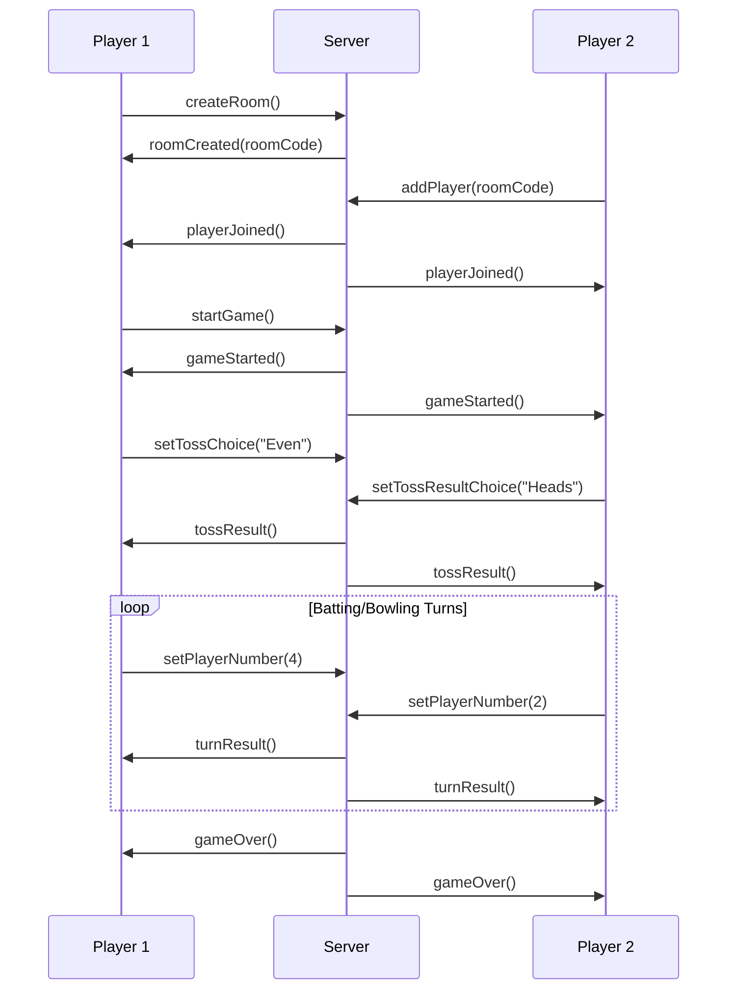

# 🏏 HandCricket Game – Full Stack Application

A real-time multiplayer web application that brings the traditional hand cricket game to life virtually. Built with a React frontend and Node.js backend, featuring dynamic gameplay with custom room codes, toss handling, batting/bowling mechanics, and live score updates.


---

## 📁 Project Structure

```
HandCricket-Game/
│
├── frontend/                    # React Client Application
│   ├── src/
│   │   ├── components/
│   │   │   ├── HandCricket.jsx      # Main game component
│   │   │   ├── HandCricketGame.jsx  # Game logic handler
│   │   │   ├── HandGesture.jsx      # Hand gesture input
│   │   │   ├── LoadingSpinner.jsx   # Loading animations
│   │   │   ├── MusicPlayer.jsx      # Background music
│   │   │   ├── NumberGrid.jsx       # Number selection grid
│   │   │   ├── RoomInput.jsx        # Room creation/joining
│   │   │   └── RoomJoin.jsx         # Room joining logic
│   │   ├── App.jsx                  # Main app component
│   │   ├── main.jsx                 # App entry point
│   │   └── assets/                  # Static assets
│   ├── package.json                 # Frontend dependencies
│   └── vite.config.js              # Vite configuration
│
├── backend/                     # Node.js Server Application
│   ├── server.js                # Express + Socket.io server
│   ├── package.json             # Backend dependencies
│   └── routes/                  # API routes (if any)
│
└── README.md                    # Project documentation
```

---

## 🚀 Features

### 🎮 **Core Gameplay**
- **Room-based multiplayer** hand cricket game
- **Real-time synchronization** using Socket.io
- **Toss mechanics** with Even/Odd and Heads/Tails
- **Turn-based innings** logic with batting/bowling

### 🎨 **User Experience**
- **Smooth animations** and dynamic UI transitions
- **Responsive design** for desktop and mobile
- **Loading states** and visual feedback
- **Background music** integration

### 🔧 **Technical Features**
- **Player reconnection** handling
- **State management** across game sessions
- **Room code system** for easy joining
- **Live score tracking** and updates

---

## ⚙️ Tech Stack

### 🖥️ **Frontend**
- **React 18+** with modern hooks
- **Vite** for fast development and building
- **Socket.io-client** for real-time communication
- **CSS3** with modern styling (optional TailwindCSS)

### 🌐 **Backend**
- **Node.js 16+** with ES6+ features
- **Express.js** for server framework
- **Socket.io** for WebSocket connections
- **CORS** enabled for cross-origin requests

---

## 🔧 Installation Instructions

### 📋 **Prerequisites**
- Node.js (v16 or higher)
- npm or yarn package manager
- Git for version control

### 1️⃣ **Clone the Repository**
```bash
git clone <repository-url>
cd HandCricket-Game
```

### 2️⃣ **Setup Backend Server**
```bash
cd backend
npm install
node server.js
```
> 🌐 **Server runs on:** `http://localhost:5000`

### 3️⃣ **Setup Frontend Client**
```bash
cd frontend
npm install
npm run dev
```
> 🖥️ **Client runs on:** `http://localhost:5173` or `http://localhost:3000`

### 4️⃣ **Start Playing**
- Open your browser to the frontend URL
- Create or join a room to start playing!

---

## 🕹️ How to Play

### **Game Setup**
1. **Open** the frontend in your browser
2. **Enter** a room code to join an existing game or create a new room
3. **Set** your player name
4. **Wait** for another player to join

### **Gameplay Flow**
1. **Toss Phase**
   - Choose Even/Odd for the coin toss
   - Call Heads/Tails for the result
   - Winner decides to bat or bowl first

2. **Batting/Bowling Phase**
   - Select a number (0-6) each turn
   - If numbers match → batsman is OUT
   - If different → batsman scores their number

3. **Innings Switch**
   - After first player gets out, roles switch
   - Second player tries to beat the first player's score

4. **Victory**
   - Player with higher score wins!
   - Game resets for another round

---

## 🔌 Socket.io Events Reference

### **Client → Server Events**

| Event Name | Parameters | Description |
|------------|------------|-------------|
| `createRoom` | `{ playerName }` | Create a new game room |
| `addPlayer` | `{ roomCode, playerName }` | Join an existing room |
| `setPlayerName` | `{ roomCode, playerName }` | Update player's display name |
| `startGame` | `{ roomCode }` | Initialize the game session |
| `setTossChoice` | `{ roomCode, choice }` | Choose Even/Odd for toss |
| `setTossResultChoice` | `{ roomCode, choice }` | Call Heads/Tails |
| `setPlayerNumber` | `{ roomCode, number }` | Submit number for turn |
| `getRuns` | `{ roomCode }` | Request current player's score |
| `getOpponentRuns` | `{ roomCode }` | Request opponent's score |

### **Server → Client Events**

| Event Name | Data | Description |
|------------|------|-------------|
| `roomCreated` | `{ roomCode }` | Room successfully created |
| `playerJoined` | `{ players }` | Player added to room |
| `gameStarted` | `{ gameState }` | Game initialization complete |
| `tossResult` | `{ winner, choice }` | Toss outcome |
| `turnResult` | `{ result, scores }` | Turn completion data |
| `gameOver` | `{ winner, finalScores }` | Game end result |

---

## 🧪 Example Game Flow



---

## 🛠️ Development

### **Available Scripts**

#### Frontend
```bash
npm run dev          # Start development server
npm run build        # Build for production
npm run preview      # Preview production build
npm run lint         # Run ESLint
```

#### Backend
```bash
node server.js       # Start the server
npm start            # Start with nodemon (if configured)
npm test             # Run tests (if configured)
```

### **Environment Variables**

#### Frontend (.env)
```env
VITE_SOCKET_URL=http://localhost:5000
VITE_API_URL=http://localhost:5000
```

#### Backend (.env)
```env
PORT=5000
NODE_ENV=development
CORS_ORIGIN=http://localhost:5173
```

---

## 🔧 Configuration

### **Vite Configuration (frontend/vite.config.js)**
```javascript
import { defineConfig } from 'vite'
import react from '@vitejs/plugin-react'

export default defineConfig({
  plugins: [react()],
  server: {
    port: 5173,
    host: true
  }
})
```

### **Server Configuration (backend/server.js)**
```javascript
const express = require('express');
const http = require('http');
const socketIo = require('socket.io');

const app = express();
const server = http.createServer(app);
const io = socketIo(server, {
  cors: {
    origin: "http://localhost:5173",
    methods: ["GET", "POST"]
  }
});

const PORT = process.env.PORT || 5000;
server.listen(PORT, () => {
  console.log(`Server running on port ${PORT}`);
});
```

---

## 🚀 Deployment

### **Frontend (Vercel/Netlify)**
```bash
npm run build
# Deploy the 'dist' folder
```

### **Backend (Heroku/Railway)**
```bash
# Add Procfile
echo "web: node server.js" > Procfile

# Deploy to your platform of choice
```

---

## 🐛 Troubleshooting

### **Common Issues**

**Connection Issues:**
```bash
# Check if backend is running
curl http://localhost:5000

# Verify Socket.io connection
# Check browser console for connection errors
```

**Port Conflicts:**
```bash
# Kill process using port 5000
lsof -ti:5000 | xargs kill -9

# Or use different port
PORT=5001 node server.js
```

**CORS Errors:**
- Ensure backend CORS is configured for frontend URL
- Check that both servers are running
- Verify environment variables

---

## 🤝 Contribution Guidelines

We welcome contributions to make HandCricket even better!

### **Getting Started**
1. **Fork** the repository
2. **Clone** your fork locally
3. **Create** a feature branch:
   ```bash
   git checkout -b feature/your-feature-name
   ```
4. **Make** your changes
5. **Test** thoroughly
6. **Commit** with clear messages:
   ```bash
   git commit -m "Add: new feature description"
   ```
7. **Push** to your fork:
   ```bash
   git push origin feature/your-feature-name
   ```
8. **Create** a Pull Request

### **Development Guidelines**
- Follow existing code style and conventions
- Add comments for complex logic
- Test both frontend and backend changes
- Update documentation as needed
- Ensure no breaking changes

---

## 📜 License

This project is licensed under the **MIT License** - see the [LICENSE](LICENSE) file for details.

---

## 🙏 Acknowledgments

- Inspired by the traditional hand cricket game
- Built with modern web technologies
- Thanks to all contributors and players!

---

## 📞 Support & Contact

- 🐛 **Bug Reports**: [Create an issue](../../issues)
- 💡 **Feature Requests**: [Start a discussion](../../discussions)
- 📧 **Contact**: [Your contact information]

---

<div align="center">

**🏏 Ready to play some hand cricket? Let's get started! 🏏**

⭐ **If you enjoyed HandCricket, please give this project a star!** ⭐

</div>